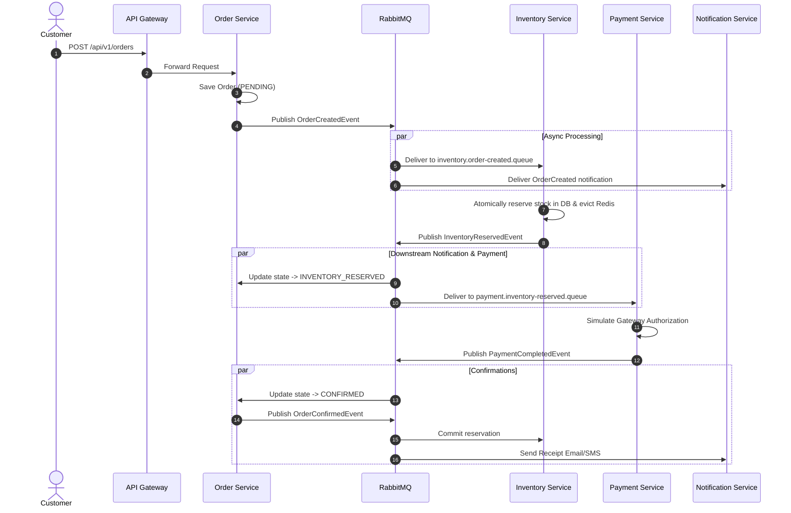

# Distributed Saga Pattern & Failure Compensation

In this system, distributed transactions are managed through a **Choreography-based Saga with Order Service state tracking**.

## 1. Happy Path Sequence

---

## 2. Failure Scenarios & Compensating Transactions

### Scenario 1: Insufficient Inventory
If requested quantity exceeds available stock:
1. `InventoryService` detects shortage (`availableQuantity < requestedQuantity`).
2. Rolls back any partial reservations in the batch.
3. Emits `InventoryReservationFailedEvent`.
4. `OrderService` transitions order status to `FAILED`.
5. No payment is ever attempted.

### Scenario 2: Payment Declined & Inventory Compensation
If payment authorization fails (card declined / network error):
1. `PaymentService` emits `PaymentFailedEvent`.
2. `OrderService` marks order status as `CANCELLED`.
3. `OrderService` emits `OrderCancelledEvent` with `compensationRequired = true`.
4. `InventoryService` consumes `OrderCancelledEvent`:
   - Runs compensating SQL: `UPDATE product_inventory SET available_quantity = available_quantity + :qty, reserved_quantity = reserved_quantity - :qty`.
   - Sets `StockReservation` status to `RELEASED`.
   - Evicts Redis cache to restore real-time availability.
5. `NotificationService` alerts customer of declined transaction.
