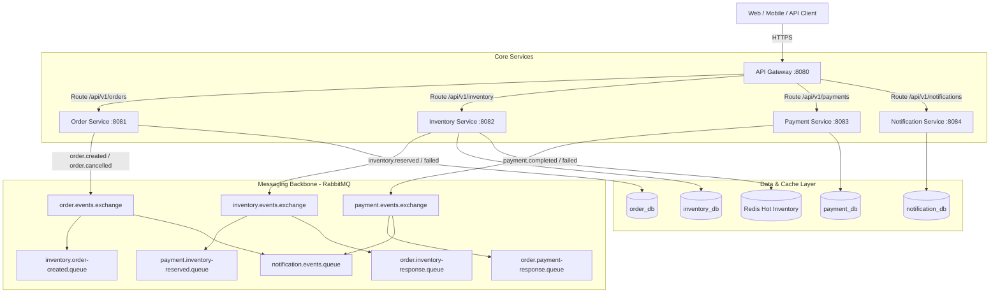

# System Architecture

The **Distributed Order Processing System** is designed as a resilient, event-driven microservices platform handling end-to-end e-commerce order lifecycles.

## Architectural Principles
1. **Database-per-service**: Microservices do not query each other's databases directly. They communicate asynchronously via RabbitMQ events and synchronously via REST through the API Gateway.
2. **Authoritative Consistency**: PostgreSQL holds durable state with ACID guarantees; Redis serves as a read-through cache for low-latency inventory reads.
3. **Eventual Consistency with Sagas**: Cross-service workflows use the Saga pattern with automatic compensation rather than fragile two-phase commit (2PC) locks.
4. **Idempotency**: All consumers implement message deduplication using a `processed_events` table to protect against network retransmissions and RabbitMQ duplicate deliveries.
